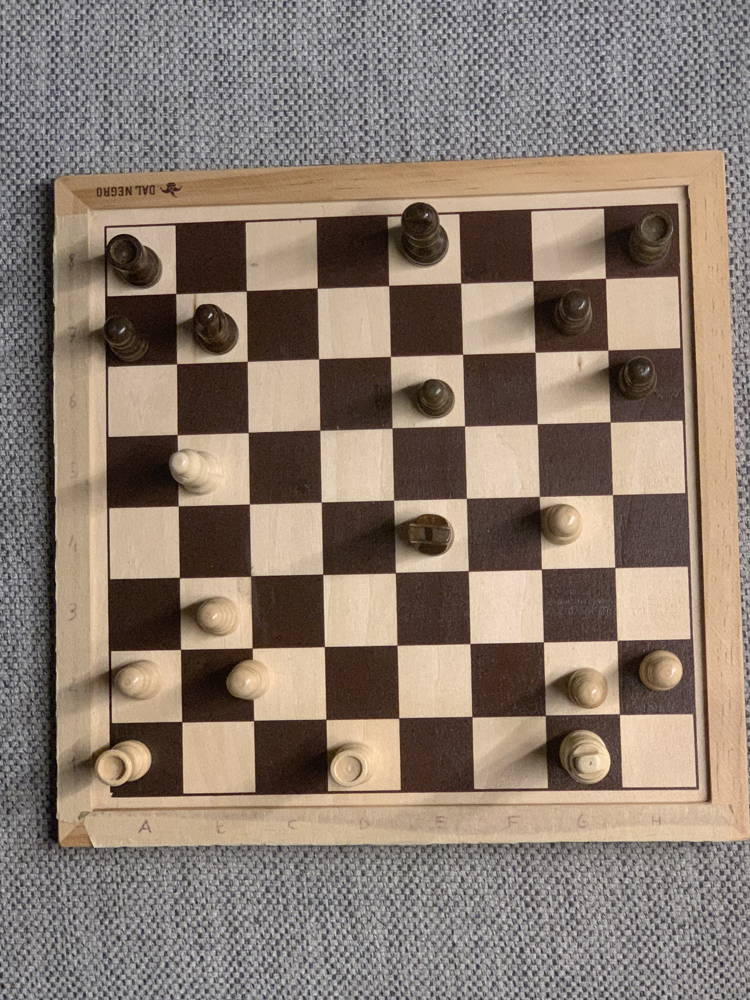
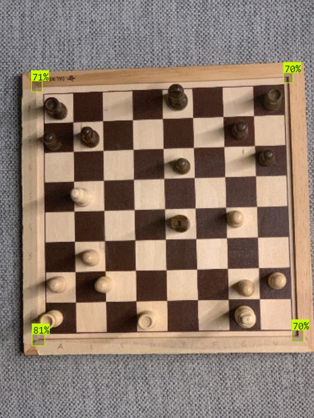
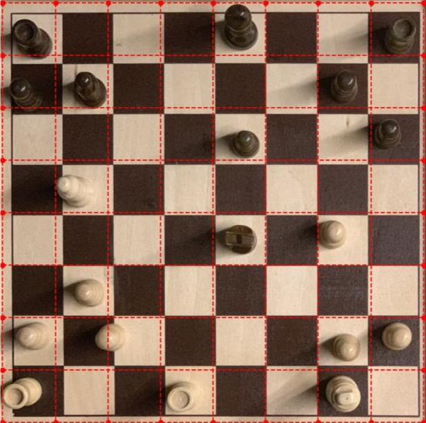
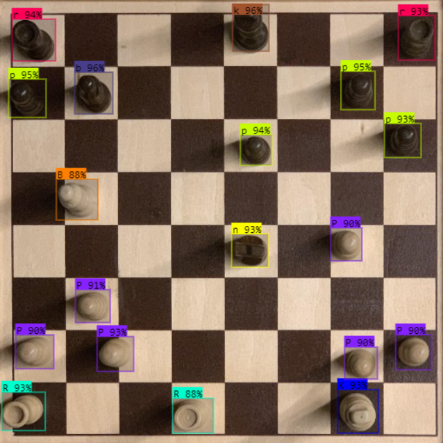
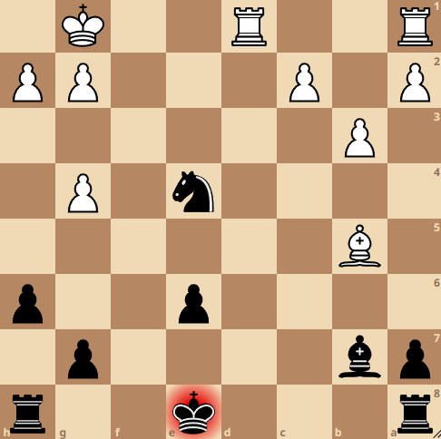
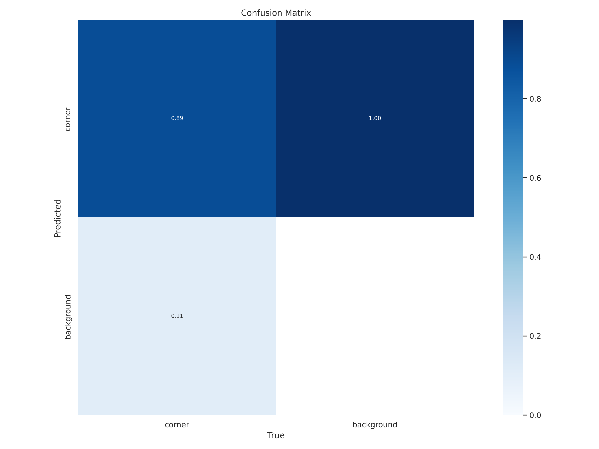
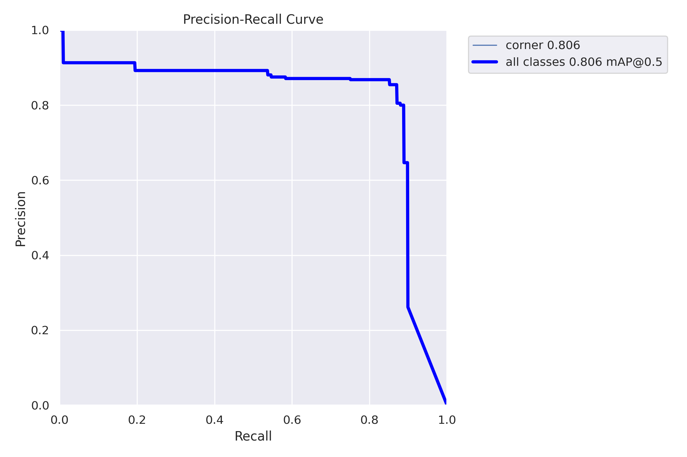
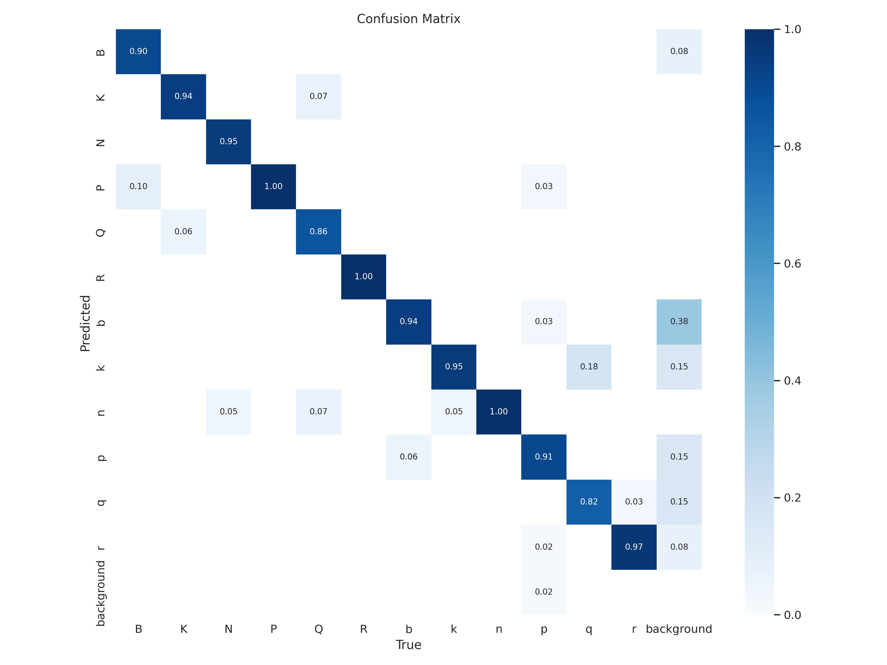
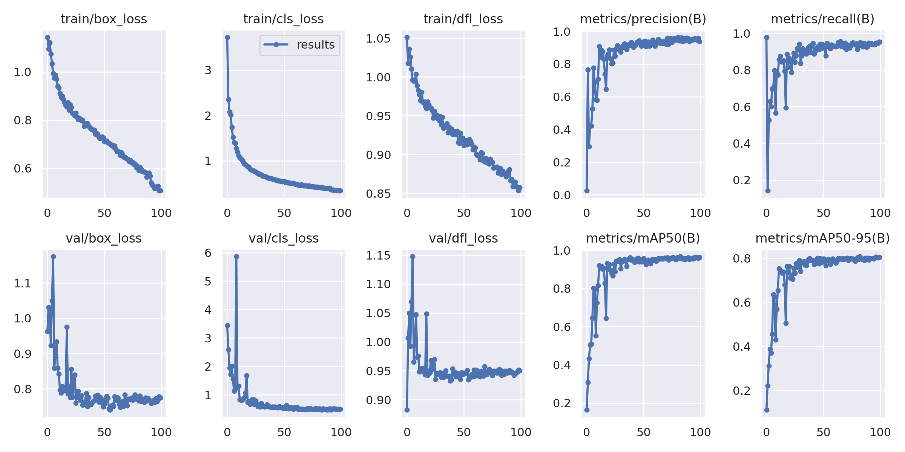
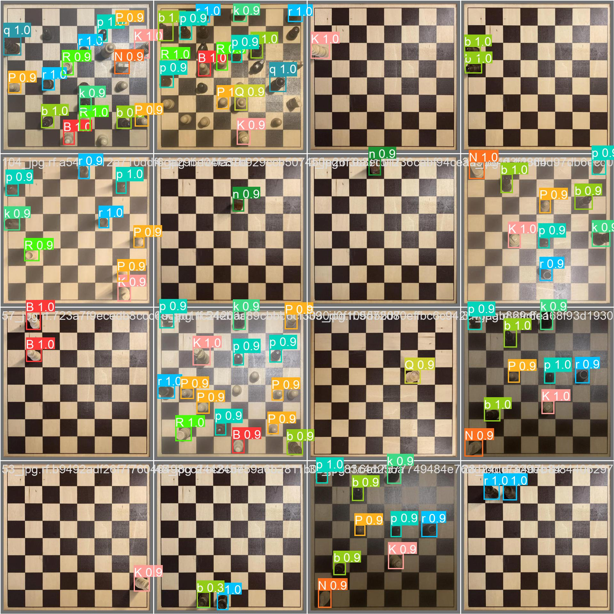

# Real chessboard to FEN
Application that leverages computer vision to detect chess pieces disposition and write it into FEN notation.

I made this work for my IoT University project.
I took inspiration from the work of @shainisan. Repo **[here](https://github.com/shainisan/real-life-chess-vision?ref=blog.roboflow.com)**.

## Usage
Download through the command:
```bash
git clone https://github.com/aledevv/real-chessboard-to-fen.git
```

- The notebook _app.ipynb_ contains all the code for detection. 

- _images_ folder contains pictures to process.

## Detection process
1. User takes a photo of their chessboard
    
2. A first model detects corners of the chessboard
    
3. Image is cropped and transformed from 3D to 2D and squares position is computed (red grid)
    
    > Grid is not perfectly aligned to the squares because the camera position for the detection was not been decided yet, so I created an __offset__ variable to adjust the grid afterwards.
4. Pieces are detected

    
5. Prediction boxes are intersected with the grid to find each piece position on the board.
6. FEN is written and can be exported to Lichess or a Stockfish API.
    

The same process is described in the repo linked above.

## Training
I used a YOLOv8n for corners detection and a YOLOv8s for pieces recognition.
### Corners
The training leaded to a mAP of 80.5%, it could be improved but it was enough for my needs.

**Confusion matrix**

**PR curve**


### Piece detection
The model reached a mAP of 96.7%.

**Confusion matrix**

**Plots**

**Batch training**

