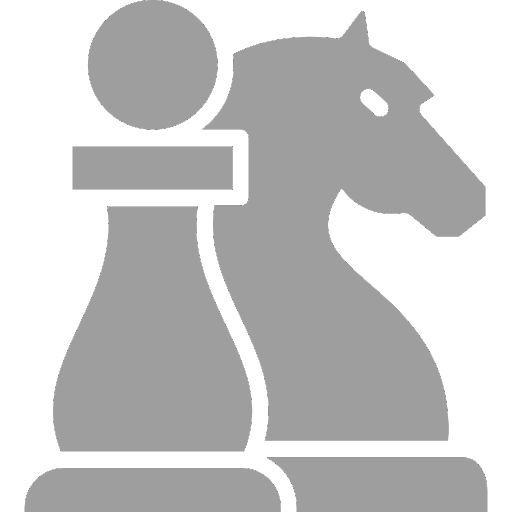
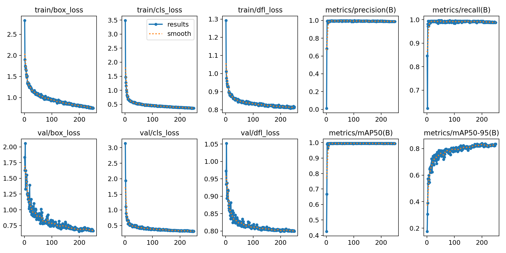
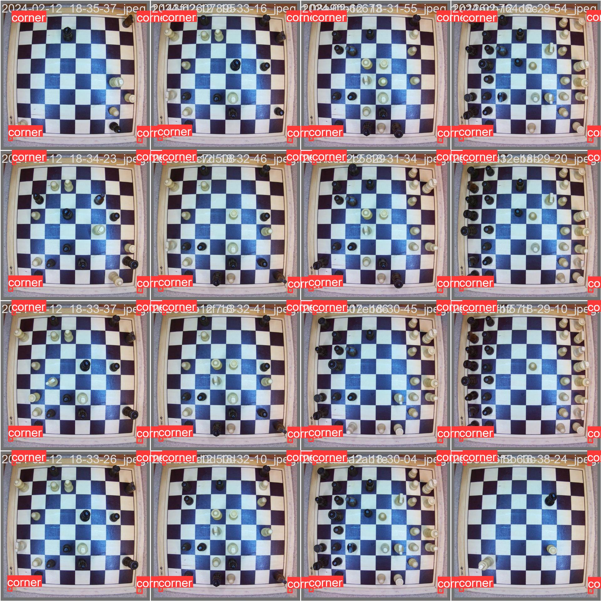
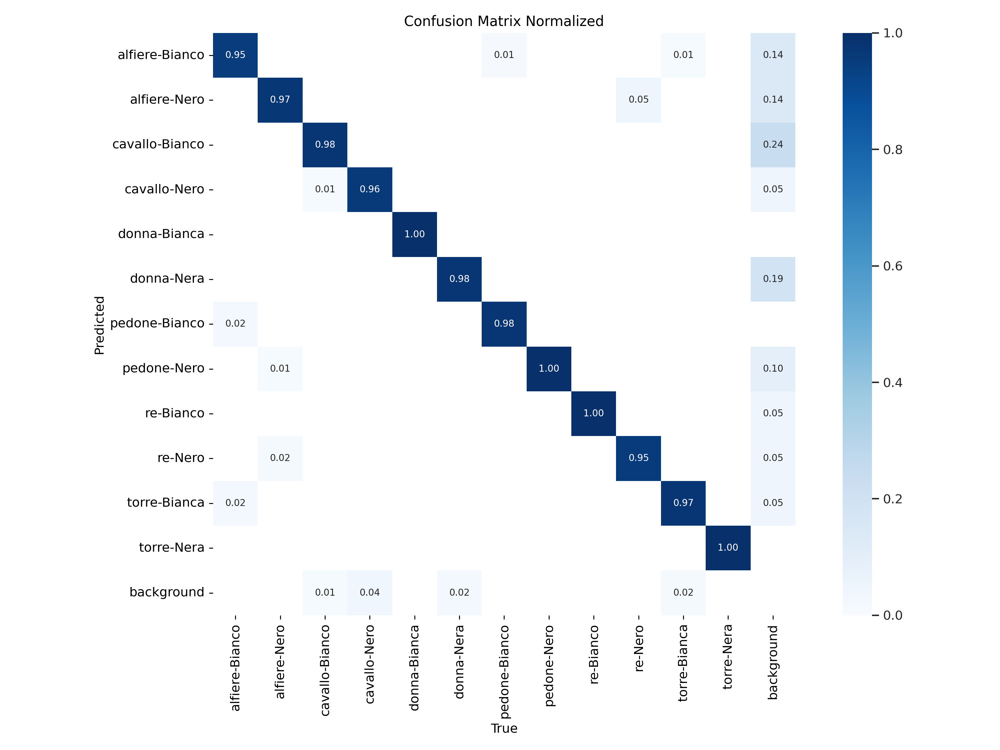
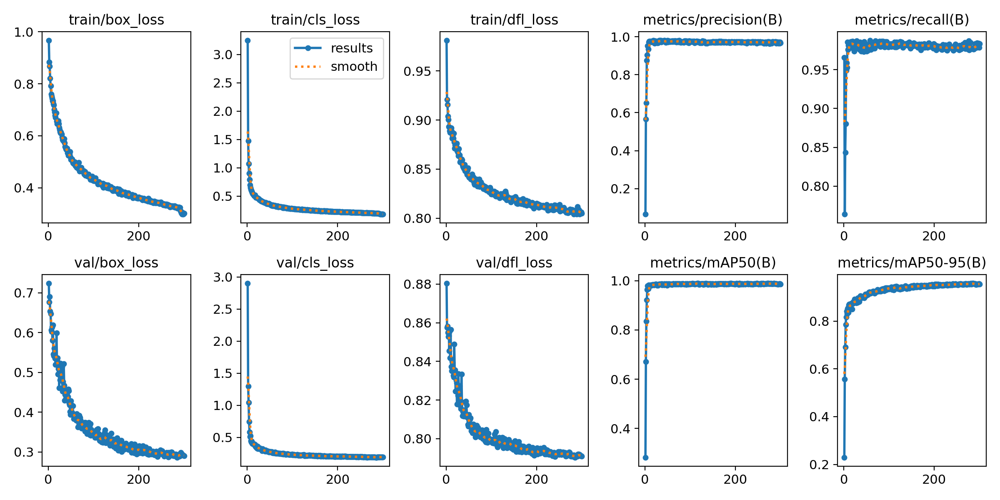
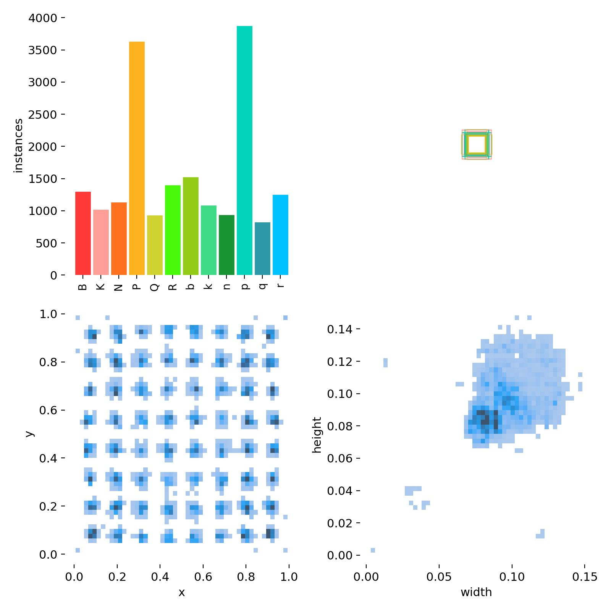
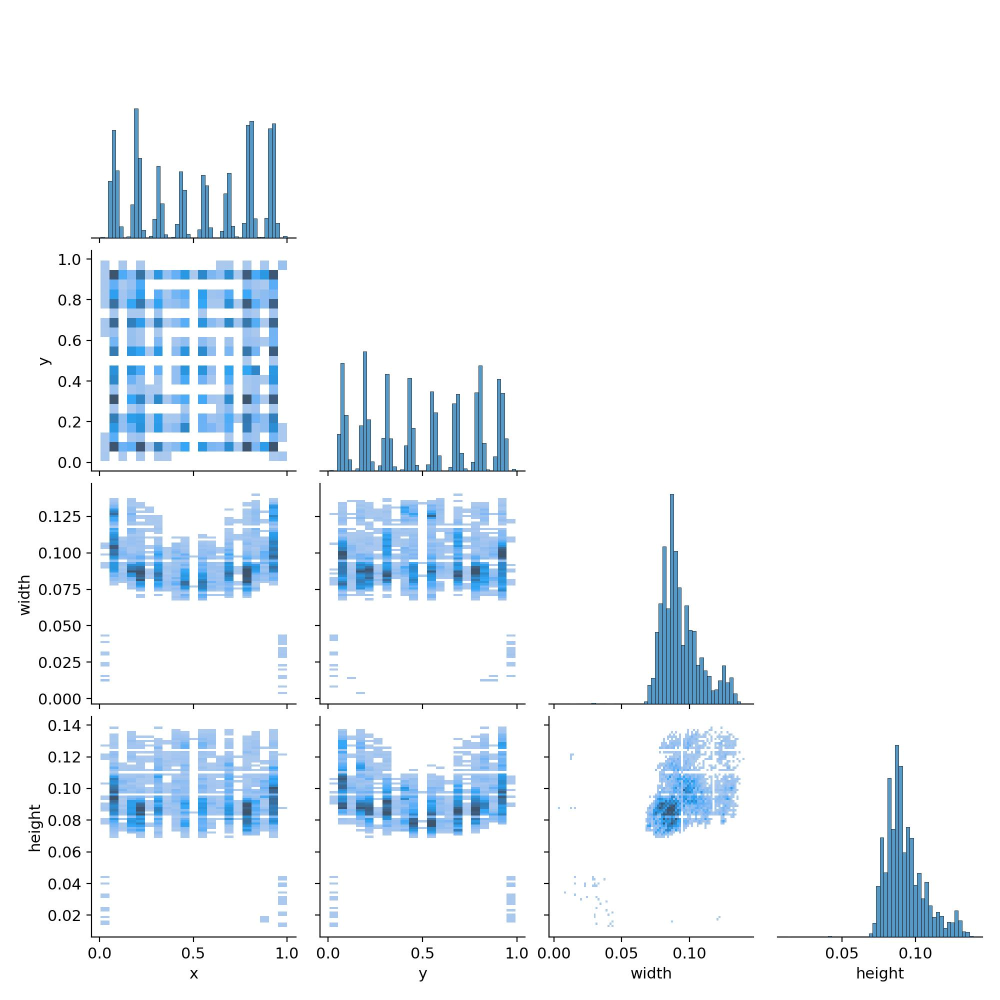

# Smartchess

<div align='center'>

</div>

<br>


[](https://choosealicense.com/licenses/mit/)

Application for Raspberry PI to play chess games on a real chessboard against Stockfish chess engine.


## Demo

Insert gif or link to demo

## Files and directories
- The notebook _app.ipynb_ contains all the code for detection
  
- The same code in the notebook is unified in _main.py_

- _images_ folder contains pictures to process.

> [!WARNING]
> **Weights are tuned using my chessboard and my pieces**.
> If you want to use yours you have to fine-tune a new model (this applies to both corner and pieces detection)

> [!TIP]  
> I found useful **[this notebook](https://colab.research.google.com/github/roboflow-ai/notebooks/blob/main/notebooks/train-yolov8-object-detection-on-custom-dataset.ipynb)** to train the YOLOv8 model.

## Detection process
1. When user makes a move a photo of their chessboard is taken
   
    
3. A first model detects corners of the chessboard
   
    
4. Image is cropped and transformed from 3D into 2D and squares position is mapped through a grid
    
   
> [!NOTE]  
> Since the camera has wide angle the image results to be distorted, as a result the **grid could not be perfectly aligned** to the squares. An __offset__ parameter has been applied to adjust the grid position once the camera is set on a fixed position.

6. Pieces are detected with a second model

    
7. Piece positions are infered by intersecating bounding box areas with grid cells
8. FEN is written and it can be exported to Lichess or sent to a Stockfish API for analysis
   
    

The same process is described in the repo linked above.

## Training
We used YOLOv8n models to both train corners and pieces recognition.
Some training details are shown below.
### Corners





### Pieces





## Project layout


```bash
├── 2fen_pgn.py
├── README.md
├── assets
│   ├── chess.png
│   ├── chess2.png
│   └── state_machine.png
├── engine.py
├── gui.py
├── images
│   ├── png
│   │   ├── 1.jpeg
│   │   └── chessboard.png
│   └── svg
│       └── chessboard.svg
├── libcairo.2.dylib
├── main.py
├── requirements.txt
└── weights
    ├── new_corners.pt
    └── pieces.pt
```


## Requiremtnts


### Hardware
- Raspberry (PI 3/4 suggested)
- Camera      ![instert model]---------------- ????
- LCD display ------------------ ????
- INSERT CABLES
- Structure ....


### Software and Dependencies
- How to set up the environment Rasperry, camera and see if they are working...
- Considerations about AI model that it is traine on that chess board and if someone wants to do it as well they have to re-train the model... potremmo dire come fare brevemente


## Installation

Clone respository   [TO UPDATE]

```bash
git clone https://github.com/aledevv/smarcess.git
```
Install requirements
```bash
pip install -r -requirements.txt
```


## Usage/Examples

```bash
python main.py
```


## Links

- [YouTube Demo Video]()    **_ADD LINK HERE_**

- Presentation link (penso sia meglio Google Presentation)
## Authors

- [Alessandro De Vidi](https://www.github.com/aledevv)
- [Daniele Marisa](https://github.com/DanMa02)
- [Enrico Tenuti](https://github.com/enricotenuti)


## License

MIT License click [here](https://choosealicense.com/licenses/mit/) for more details.

